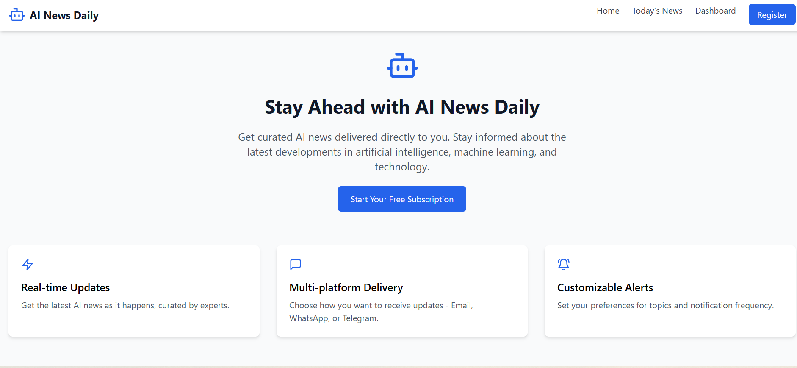
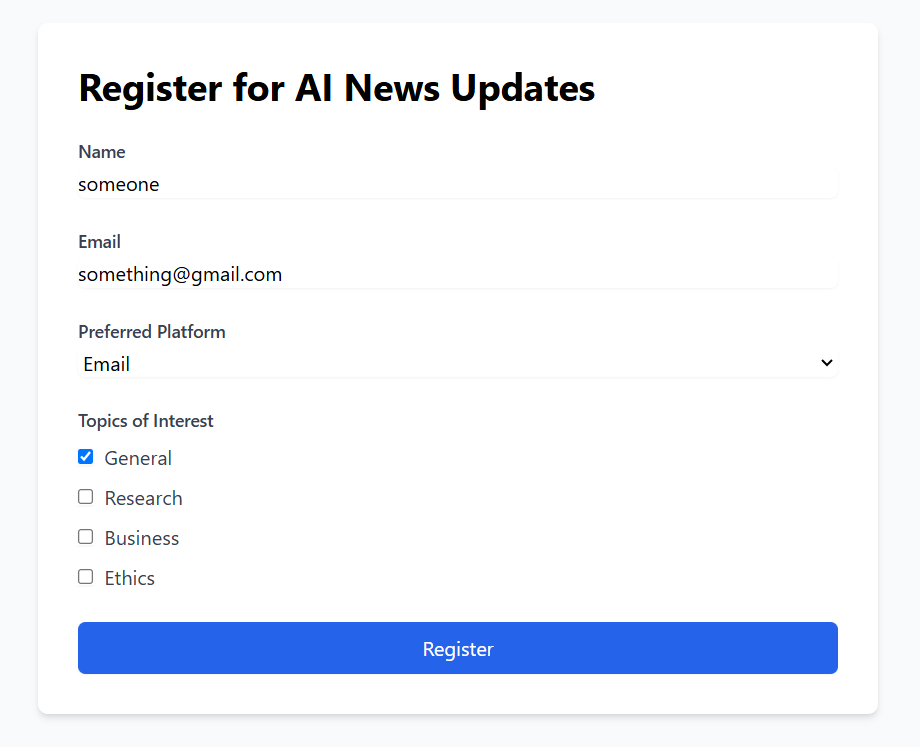
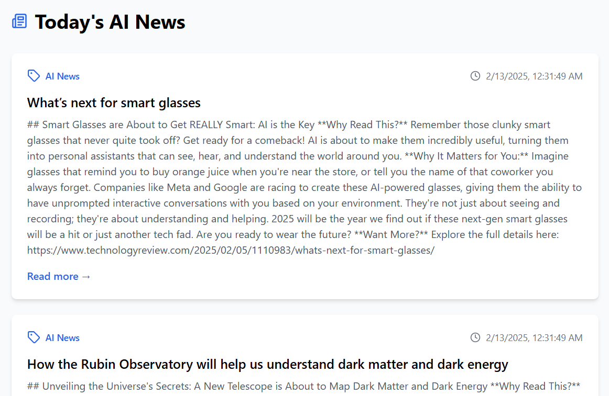

I have created this repository to help the commmunity owners who everyday struggle alot to find latest AI news then furnish them using AI tools , this easy process waste their time alot so i created this to help them. `It sends and fetched the news every 24 hours.`

FEATURES TO BE ADDED:-
1. Whatsapp/telegram/discord connectivity
2. Dashboard Working option
3. Google authentication system
4. Formating the news

USAGE STEPS:-
## Running Backend
1. Till now you have to just clone the repo
2. Create a file named '.env'
3. Add your Gemini API key, email and email passkey in .env file (API_KEY = '<your API key>', EMAIL = '', MAIL_PASSWORD = '') 
4. Then in your terminal install all the required libraries using `pip install -r requirements.txt`
5. Then in your terminal either run the "app.py" file by fastapi cmd or uvicorn cmd

fastapi cmd => `fastapi dev app.py`
uvicorn cmd => `uvicorn app:app --host 127.0.0.1 --port 5662`

## Running Frontend
1. Goto the frontend folder in the repo
2. Create a file named '.env'
3. Add following things :- 

`
VITE_SUPABASE_URL=''
VITE_SUPABASE_ANON_KEY='' 
VITE_API_BASE_URL= ''
VITE_APP_API_BASE_URL= ""
`

4. run the cmd `npm install`
5. run the cmd `npm run dev`

DEMONSTRATION
The landing page shown below

The registraion page

The page where you can see the today's AI news (Updated every 24 hours)
